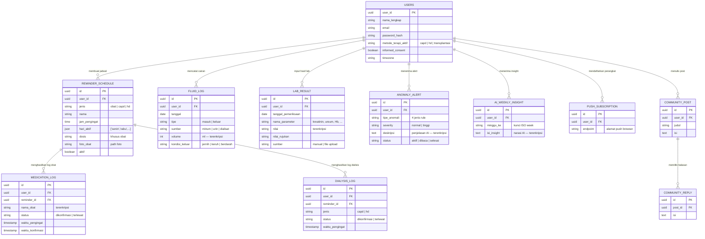

# 📋 Contekan Presentasi — KidneyBuddy

> Acuan presentasi & demo untuk mata kuliah PSI — Kelompok 7.
> Live app: **https://kidney-buddy-app.vercel.app** · Akun demo: `lukman@demo.kidneybuddy.id` / `Demo1234!`

---

## 1. Tentang Apa Aplikasi Ini?

**KidneyBuddy adalah web app (PWA) pendamping harian untuk pasien gagal ginjal kronis di Indonesia.**

Pasien gagal ginjal kronis punya rutinitas terapi yang **tidak boleh terlewat**:

| Tipe Pasien | Rutinitas Hariannya |
|---|---|
| **CAPD** (cuci darah lewat perut, mandiri di rumah) | Ganti cairan dialisis 3–5x sehari, catat volume masuk/keluar, minum obat |
| **HD** (hemodialisis, cuci darah di RS) | Jadwal HD 2–3x seminggu, batasi asupan cairan harian, minum obat |
| **Transplantasi** | Obat imunosupresan **seumur hidup** tepat waktu, kontrol lab rutin |

**Masalahnya:** selama ini pasien mengandalkan ingatan dan catatan kertas. Lupa satu dosis obat imunosupresan atau satu sesi CAPD bisa berujung komplikasi serius (penolakan organ, peritonitis, overload cairan).

**Solusinya:** KidneyBuddy menjadi "asisten saku" yang (1) **mengingatkan** terapi lewat notifikasi, (2) **mencatat** semua data kesehatan harian, (3) **mengubah catatan itu menjadi informasi & insight** — grafik tren, deteksi anomali oleh AI, ringkasan mingguan, dan laporan siap-cetak untuk dokter.

> 💬 **Kalimat pembuka presentasi:**
> *"Bayangkan pasien cuci darah mandiri di rumah yang harus ganti cairan 4 kali sehari, minum 6 macam obat, dan mencatat semuanya di buku tulis. Satu kelalaian bisa berarti masuk IGD. KidneyBuddy mengubah buku tulis itu menjadi sistem informasi yang mengingatkan, mencatat, dan memberi peringatan dini."*

---

## 2. Klasifikasi Sistem Informasi: TPS / MIS / DSS / EIS

Ini pemetaan level sistem informasi di dalam KidneyBuddy (materi inti PSI):

```
        ┌─────────────────────────────┐
        │   EIS — Laporan Dokter      │  ← ringkasan eksekutif utk pengambil keputusan medis
        ├─────────────────────────────┤
        │   DSS — AI Insight & Alert  │  ← rekomendasi & peringatan dini berbasis analisis
        ├─────────────────────────────┤
        │   MIS — Dashboard & Grafik  │  ← agregasi data jadi informasi manajerial
        ├─────────────────────────────┤
        │   TPS — Pencatatan Harian   │  ← transaksi mentah: log cairan, obat, lab
        └─────────────────────────────┘
```

| Level | Fitur di KidneyBuddy | Halaman Demo | Penjelasan |
|---|---|---|---|
| **TPS** (Transaction Processing System) | Pencatatan log cairan masuk/keluar, konfirmasi (centang) minum obat, log exchange CAPD, input hasil lab, upload foto obat | `/catatan`, `/pengingat` | Ini lapisan **transaksi mentah** — setiap centang obat = 1 record `medication_log`, setiap catat cairan = 1 record `fluid_log`. Volume tinggi, terstruktur, rutin — ciri khas TPS. |
| **MIS** (Management Information System) | Dashboard beranda (ringkasan cairan hari ini, kepatuhan obat, pengingat berikutnya), grafik tren lab 6 bulan, riwayat kepatuhan | `/beranda`, `/catatan` | Data transaksi **diagregasi** jadi informasi: "hari ini sudah minum 800ml dari batas 1000ml", "kepatuhan obat minggu ini 95%". Menjawab pertanyaan *"bagaimana kondisiku?"* |
| **DSS** (Decision Support System) | **AI anomaly detection** (deteksi pola menyimpang + penjelasan AI), analisis hasil lab oleh AI, saran gaya hidup | `/notifikasi`, `/catatan` | Sistem **membantu keputusan**: "volume keluar CAPD-mu menurun 3 hari berturut — pertimbangkan hubungi perawat". Pasien tetap yang memutuskan, sistem memberi dasar. |
| **EIS** (Executive Information System) | **Laporan Dokter** — PDF ringkasan kondisi pasien satu periode (tren lab, kepatuhan, anomali) siap dibawa ke poli | `/laporan` | "Eksekutif"-nya di sini adalah **dokter/nakes** — pengambil keputusan tertinggi atas terapi pasien. Dokter tidak perlu data mentah, cukup ringkasan padat untuk memutuskan penyesuaian terapi. |

> 💬 **Poin argumen:** satu aplikasi ini mendemonstrasikan **piramida sistem informasi lengkap** — dari transaksi mentah (TPS) sampai ringkasan eksekutif (EIS) — dalam satu alur data yang nyata.

---

## 3. Proses Bisnis Aplikasi

### 3.1 Proses Bisnis Utama (Business Process)

Ada **5 proses bisnis inti** yang saling terhubung:

```
 ┌────────────┐    ┌─────────────┐    ┌──────────────┐    ┌──────────────┐    ┌─────────────┐
 │ 1.REGISTRASI│ →  │ 2.PENGINGAT │ →  │ 3.PENCATATAN │ →  │ 4.ANALISIS   │ →  │ 5.PELAPORAN │
 │ & Onboarding│    │   Terapi    │    │   Harian     │    │   AI/Insight │    │   ke Dokter │
 └────────────┘    └─────────────┘    └──────────────┘    └──────────────┘    └─────────────┘
```

**Proses 1 — Registrasi & Onboarding**
1. Pasien registrasi (nama, email, password) + **informed consent** eksplisit (data kesehatan sensitif).
2. Onboarding: pilih metode terapi (CAPD / HD / Transplantasi) → aplikasi **menyesuaikan seluruh fitur** dengan tipe terapi (pasien HD tidak melihat fitur exchange CAPD, dst).

**Proses 2 — Pengingat Terapi (jantungnya aplikasi)**
1. Pasien membuat jadwal pengingat: obat (nama, dosis, foto obat), exchange CAPD (konsentrasi cairan), atau sesi HD — dengan jam & hari aktif.
2. **Scheduler di backend berjalan tiap menit**, mengecek pengingat yang jatuh tempo di database.
3. Saat waktunya tiba → **web push notification** terkirim ke HP pasien (bahkan saat aplikasi tertutup).
4. Pasien membuka app → **centang konfirmasi** → tercatat sebagai transaksi kepatuhan (`dikonfirmasi` / `terlewat`).

**Proses 3 — Pencatatan Harian (TPS)**
1. Log cairan: minum air = cairan masuk; urin/cairan dialisat keluar = cairan keluar (+ kondisi cairan: jernih/keruh/berdarah — penting untuk CAPD!).
2. Konfirmasi obat & exchange otomatis menjadi log kepatuhan.
3. Input hasil lab manual (kreatinin, ureum, hemoglobin, kalium, dst.) atau upload file PDF/foto hasil lab.

**Proses 4 — Analisis & Deteksi Anomali (DSS)**
1. **Setiap entri baru** memicu pengecekan 4 aturan anomali (dijelaskan di bagian AI).
2. Jika terdeteksi → AI (Groq Llama 3.3) menuliskan **penjelasan berbahasa awam** → alert muncul di app + push notification darurat untuk severity tinggi.
3. Tiap minggu, AI merangkum tren 7–30 hari menjadi **insight mingguan** + saran konkret.

**Proses 5 — Pelaporan (EIS)**
1. Menjelang jadwal kontrol, pasien membuka `/laporan` → pilih periode.
2. Sistem meng-generate **laporan ringkas** (tren lab, statistik kepatuhan, daftar anomali) → preview → cetak/PDF → dibawa ke dokter.

### 3.2 Skenario Demo (cerita untuk dibacakan saat presentasi)

> **Tokoh: Pak Lukman, 52 tahun, pasien CAPD** (pakai akun demo `lukman@demo.kidneybuddy.id`)

| # | Adegan | Yang Dilakukan di Demo | Yang Diceritakan |
|---|---|---|---|
| 1 | **Pagi hari** | Buka app dari ikon home screen (tunjukkan ini PWA ter-install) | "Pak Lukman tidak buka browser — KidneyBuddy terpasang seperti aplikasi biasa di HP-nya." |
| 2 | **Notifikasi masuk** | Tunjukkan push notification pengingat obat/exchange | "Jam 7 pagi, HP-nya bergetar: waktunya obat tekanan darah. Ini dikirim server kami, bukan alarm lokal — jadi tetap jalan walau app tertutup." |
| 3 | **Konfirmasi obat** (TPS) | Buka `/pengingat`, centang satu pengingat | "Satu centang = satu transaksi tercatat di database. Inilah TPS — data mentah kepatuhan terapi." |
| 4 | **Catat cairan** (TPS) | Buka `/catatan`, tambah log cairan masuk (mis. minum 200ml) dan log CAPD keluar | "Pasien CAPD wajib mencatat volume dan kondisi cairan. Perhatikan: ada pilihan kondisi cairan — jernih atau keruh." |
| 5 | **Dashboard** (MIS) | Kembali ke `/beranda`, tunjukkan ringkasan cairan hari ini, kepatuhan, kartu 'Pengingat Berikutnya' | "Data mentah tadi langsung teragregasi: total cairan hari ini vs batas harian, persentase kepatuhan. Data → menjadi → informasi." |
| 6 | **Anomali terdeteksi** (DSS) | Buka `/notifikasi`, tunjukkan anomaly alert yang ada (akun demo punya riwayat 6 bulan, ada alert) | "Tiga hari terakhir volume cairan keluar Pak Lukman menurun. Sistem mendeteksinya otomatis, dan AI menjelaskannya dalam bahasa awam + saran tindakan. Untuk kasus berat — cairan keruh, indikasi peritonitis — push darurat langsung terkirim." |
| 7 | **Grafik tren lab** (MIS) | Buka `/catatan`, tunjukkan grafik tren kreatinin/hemoglobin 6 bulan | "Angka lab yang tadinya lembar-lembar kertas kini jadi kurva tren — pasien bisa melihat arah kondisinya." |
| 8 | **Laporan dokter** (EIS) | Buka `/laporan` → generate → preview | "Besok Pak Lukman kontrol. Satu klik: seluruh 6 bulan data terangkum jadi laporan siap cetak untuk dokternya. Ini level EIS — informasi eksekutif untuk pengambil keputusan medis." |
| 9 | **Edukasi & Komunitas** (pelengkap) | Sekilas buka `/edukasi` dan komunitas | "Pasien juga dapat konten edukasi berbahasa Indonesia awam dan forum sesama pasien." |

> ⚠️ **Tips demo:** jangan centang/mengubah banyak data akun demo saat latihan — kalau data berantakan, minta reseed. Kartu "Pengingat Berikutnya" di beranda hanya display; centang dilakukan di halaman Pengingat.

---

## 4. Bagaimana Data Menjadi Informasi?

Ini alur transformasi **data → informasi → insight → keputusan** di KidneyBuddy:

```
  DATA MENTAH              INFORMASI                 INSIGHT (AI)              KEPUTUSAN
  (apa yang dicatat)       (apa artinya)             (apa yang harus         (siapa memutuskan)
                                                      diwaspadai)
 ┌──────────────────┐   ┌──────────────────────┐   ┌────────────────────┐   ┌────────────────┐
 │ • log cairan     │   │ • total cairan/hari  │   │ • deteksi anomali  │   │ Pasien:        │
 │   (ml, jam,      │ → │   vs batas harian    │ → │   4 aturan + AI    │ → │  hubungi nakes?│
 │   kondisi)       │   │ • % kepatuhan obat   │   │   menjelaskan      │   │  atur cairan?  │
 │ • centang obat   │   │   mingguan           │   │ • ringkasan harian │   │                │
 │ • hasil lab      │   │ • grafik tren lab    │   │ • insight mingguan │   │ Dokter:        │
 │   (angka + tgl)  │   │   6 bulan            │   │   + saran konkret  │   │  sesuaikan     │
 │ • log exchange   │   │ • riwayat jadwal     │   │ • analisis AI tiap │   │  terapi (via   │
 │   CAPD           │   │   terlewat           │   │   hasil lab baru   │   │  laporan)      │
 └──────────────────┘   └──────────────────────┘   └────────────────────┘   └────────────────┘
       TPS                       MIS                     DSS                      EIS
```

**Contoh konkret satu data mengalir sampai jadi keputusan:**
1. **Data:** Pak Lukman mencatat cairan keluar CAPD `1.800 ml, kondisi: keruh` (satu baris di tabel `fluid_log`).
2. **Informasi:** dashboard menampilkan "keseimbangan cairan hari ini: −200 ml dari kemarin".
3. **Insight:** rule engine mendeteksi `kondisi_cairan_abnormal` (keruh = indikasi peritonitis) → severity **tinggi** → AI menulis: *"Cairan keruh bisa menandakan infeksi. Segera hubungi perawat CAPD Anda hari ini."* → push darurat terkirim ke semua perangkat.
4. **Keputusan:** pasien menelepon perawat; saat kontrol, dokter melihat kejadian ini di **laporan** dan menyesuaikan terapi.

---

## 5. Struktur Data Aplikasi

### 5.1 Gambaran Umum

Database PostgreSQL berisi **22 tabel** yang bisa dikelompokkan menjadi 5 kelompok:

| Kelompok | Tabel | Fungsi |
|---|---|---|
| 🧑 **Identitas & Akun** | `users`, `therapy_history`, `onboarding_progress`, `refresh_tokens`, `login_attempts`, `password_reset_tokens` | Profil pasien, metode terapi aktif, keamanan login (lockout 5x gagal), riwayat ganti terapi |
| ⏰ **Pengingat & Kepatuhan** | `reminder_schedule`, `medication_log`, `dialysis_log`, `push_subscriptions` | Jadwal pengingat (obat/CAPD/HD), transaksi konfirmasi, endpoint push tiap perangkat |
| 📝 **Pencatatan Kesehatan** | `fluid_log`, `lab_result`, `daily_activities` | Log cairan masuk/keluar, hasil lab per parameter, aktivitas harian — **kolom sensitif dienkripsi AES-256-GCM** |
| 🤖 **AI & Anomali** | `anomaly_alerts`, `ai_daily_summaries`, `ai_weekly_insights`, `ai_lab_analyses`, `ai_lifestyle_suggestions` | Hasil deteksi anomali + output AI yang di-cache (agar tidak memanggil AI berulang untuk data sama) |
| 👥 **Edukasi & Komunitas** | `education_content`, `community_posts`, `community_replies`, `community_reply_helpful` | Konten edukasi bahasa awam + forum tanya-jawab sesama pasien |

### 5.2 Diagram Struktur Data (ERD — entitas inti)

> Diagram ini otomatis ter-render sebagai gambar jika dibuka di GitHub / VS Code (Mermaid).



**Poin yang bisa disorot ke dosen:**
- **Relasi 1-ke-banyak** yang jelas: 1 user → banyak log; 1 jadwal pengingat → banyak log konfirmasi (histori kepatuhan).
- **Enkripsi at-rest di level aplikasi**: kolom kesehatan sensitif (volume cairan, nilai lab, nama obat, deskripsi anomali) dienkripsi **AES-256-GCM sebelum masuk database** — bahkan admin database tidak bisa membaca data kesehatan pasien.
- **Soft delete & audit**: `created_at`/`updated_at`/`deleted_at` di tabel utama.
- **Output AI di-cache di tabel sendiri** (`ai_*`) — hemat kuota API dan hasil konsisten.

---

## 6. Tech Stack & Alasan Pemilihannya

### 6.1 Arsitektur: Microservices 3 Container

```
┌───────────────────────────────────────────────────────────────────┐
│                          PENGGUNA (HP/Laptop)                     │
│                     PWA ter-install + Push Notification           │
└───────────────────────────────┬───────────────────────────────────┘
                                │ HTTPS
                ┌───────────────▼───────────────┐
                │   CONTAINER 1: FRONTEND       │
                │   Next.js 16 (PWA)            │──── deploy: Vercel
                │   UI, service worker, manifest│
                └───────────────┬───────────────┘
                                │ REST API (JSON) — satu-satunya jalur
                ┌───────────────▼───────────────┐
                │   CONTAINER 2: BACKEND        │
                │   Express.js 5                │──── deploy: Railway
                │   Auth, bisnis logic,         │
                │   scheduler pengingat,        │───────┐
                │   panggilan AI, web push      │       │ API call
                └───────────────┬───────────────┘       ▼
                                │ SQL           ┌───────────────┐
                ┌───────────────▼─────────────┐ │  Groq Cloud   │
                │   CONTAINER 3: DATABASE     │ │  Llama 3.3 70B│
                │   PostgreSQL 16             │ └───────────────┘
                │   22 tabel, enkripsi kolom  │──── deploy: Railway
                └─────────────────────────────┘
```

- **Frontend TIDAK PERNAH akses database langsung** — semua lewat REST API backend (arsitektur berlapis, requirement microservices terpenuhi).
- Tiap container punya **Dockerfile sendiri**, diorkestrasi `docker-compose.yml` saat development lokal.
- Produksi: frontend di **Vercel**, backend + database di **Railway** — push ke GitHub `main` otomatis men-deploy keduanya (CI/CD).

### 6.2 Pilihan Teknologi + Argumen

| Teknologi | Peran | **Kenapa dipilih? (argumen)** |
|---|---|---|
| **Next.js 16** (App Router) | Frontend | (1) Dukungan **PWA bawaan** — manifest & service worker tanpa plugin tambahan; (2) React framework paling matang dengan routing, optimasi gambar, dan code-splitting otomatis → penting untuk target load ≤3 detik; (3) deploy 1-klik ke Vercel (framework milik Vercel sendiri). |
| **Express.js 5** | Backend REST API | (1) Framework Node.js paling luas dipakai → dokumentasi & komunitas terbesar, cocok untuk tim mahasiswa; (2) ringan dan tidak memaksakan struktur → bebas menyusun arsitektur berlapis (routes → controllers → services → repositories); (3) Express 5 meneruskan error async otomatis → kode lebih bersih. |
| **PostgreSQL 16** | Database | (1) Database relasional open-source paling andal untuk **data terstruktur dengan relasi ketat** (log kesehatan wajib konsisten — ACID); (2) dukungan `jsonb` untuk kolom fleksibel seperti `hari_aktif`; (3) gratis dan tersedia managed di Railway. |
| **Drizzle ORM** | Lapisan akses data | (1) **Type-safe** — kesalahan query ketahuan saat kompilasi TypeScript, bukan saat runtime di depan pasien; (2) migrasi ter-versi (22 tabel berevolusi rapi lewat file migrasi); (3) lebih ringan dari Prisma, query mendekati SQL asli → mudah diaudit. |
| **PWA (Serwist + Web Push API)** | "Aplikasi" di HP | (1) **Satu codebase untuk Android, iOS, dan desktop** — tidak perlu bikin app native terpisah (realistis untuk tim mahasiswa & timeline 13 minggu); (2) installable ke home screen + notifikasi push standar terbuka (VAPID) tanpa bergantung vendor (tanpa Firebase); (3) bisa diakses langsung via URL — tanpa app store. |
| **Groq API — Llama 3.3 70B** | AI | (1) **Inference tercepat di industri** (LPU) → penjelasan anomali muncul hampir instan; (2) **free tier memadai** untuk skala proyek; (3) Llama 3.3 70B mampu ber-Bahasa Indonesia awam dengan baik; (4) dipanggil **hanya dari backend** → API key aman, tidak pernah terekspos ke browser. |
| **Docker + docker-compose** | Kontainerisasi | (1) Requirement arsitektur microservices; (2) lingkungan identik di laptop semua anggota tim ("works on my machine" hilang); (3) tiap layanan bisa di-scale/diganti terpisah. |
| **JWT + httpOnly cookie** | Autentikasi | (1) Access token pendek (15 menit) di memori + refresh token di **cookie httpOnly** → tahan pencurian token via XSS (localStorage sengaja dihindari); (2) stateless → backend tetap ringan. |
| **argon2** | Hash password | Rekomendasi #1 OWASP saat ini — memory-hard, lebih tahan cracking GPU dibanding bcrypt/MD5. |
| **AES-256-GCM (app-level)** | Enkripsi data kesehatan | Data sensitif dienkripsi **di aplikasi sebelum masuk DB** — kunci tidak pernah menyentuh database, lebih kuat daripada enkripsi di sisi database (pgcrypto) yang kuncinya lewat di query. |

> 💬 **Kalimat argumen penutup tech stack:**
> *"Prinsip pemilihan kami: teknologi yang matang dan terdokumentasi baik (bukan yang paling trendi), gratis di tier yang kami butuhkan, dan mendukung requirement non-fungsional — keamanan data kesehatan, kecepatan load, dan keandalan pengingat."*

---

## 7. AI di KidneyBuddy

### 7.1 AI Apa yang Dipakai?

- **Model:** Llama 3.3 70B Versatile (open-weight dari Meta)
- **Penyedia:** **Groq Cloud API** — dipanggil dari **backend saja** (API key tidak pernah ke browser)
- **Peran AI:** *menerjemahkan data medis menjadi bahasa manusia* + memberi saran — **bukan mendiagnosis**. Setiap output AI selalu diberi **disclaimer** bahwa ini bukan pengganti nasihat medis.

### 7.2 Desain Hybrid: Rule Engine + AI (poin teknis paling menjual!)

Deteksi anomali **TIDAK diserahkan mentah ke AI**. Kami pakai desain 2 lapis:

```
  Data pasien baru masuk (log cairan / centang obat / log CAPD)
        │
        ▼
  ┌─────────────────────────────┐
  │ LAPIS 1: RULE ENGINE        │  ← deterministik, pasti, bisa diaudit
  │ (4 aturan medis di kode)    │
  └──────────┬──────────────────┘
             │ rule terpicu?
             ▼ ya
  ┌─────────────────────────────┐
  │ LAPIS 2: AI (Groq Llama 3.3)│  ← generatif: jelaskan dalam bahasa awam
  │ "jelaskan temuan ini ke     │     + saran tindakan
  │  pasien dengan bahasa awam" │
  └──────────┬──────────────────┘
             ▼
  Alert tersimpan (terenkripsi) → tampil di app
  + severity "tinggi" → PUSH DARURAT ke semua perangkat pasien
```

**4 aturan anomali:**

| Rule | Yang Dideteksi | Severity |
|---|---|---|
| `penurunan_volume_keluar` | Volume cairan keluar CAPD menurun beberapa hari berturut (indikasi masalah ultrafiltrasi) | normal |
| `kondisi_cairan_abnormal` | Cairan dialisat **keruh/berdarah** (indikasi peritonitis — gawat!) | **tinggi** → push darurat |
| `jadwal_terlewat` | Lebih dari 2 jadwal terapi terlewat dalam sehari | **tinggi** → push darurat |
| `pola_asupan_menyimpang` | Pola asupan cairan menyimpang jauh dari kebiasaan pasien | normal |

> 💬 **Argumen kenapa hybrid (siapkan untuk pertanyaan dosen):**
> *"Keputusan 'ada anomali atau tidak' harus **pasti dan bisa diaudit** — maka pakai aturan deterministik, bukan AI yang bisa berhalusinasi. AI kami tempatkan di posisi yang dia kuat: **mengubah temuan teknis menjadi penjelasan empatik berbahasa awam**. Kalau API AI sedang gagal, sistem tetap jalan pakai template penjelasan cadangan (fallback) — alert tidak pernah hilang hanya karena AI down."*

### 7.3 AI Membaca Data Apa → Menghasilkan Insight Apa?

| Fitur AI | Data yang Dibaca AI | Output / Insight | Kapan Jalan |
|---|---|---|---|
| **Penjelasan Anomali** | Detail rule yang terpicu + konteks data pemicunya (mis. volume 3 hari terakhir) + tipe terapi pasien | Penjelasan bahasa awam + saran tindakan ("hubungi perawat", "kurangi asupan garam") | Setiap ada entri baru + batch harian jam 21:00 WIB |
| **Ringkasan Harian** | Seluruh log hari itu: cairan masuk/keluar, obat dikonfirmasi/terlewat, exchange CAPD | Narasi singkat kondisi hari ini ("Hari ini kepatuhanmu bagus, tapi asupan cairan mendekati batas...") | Saat pasien membuka ringkasan (hasil di-cache per hari) |
| **Insight Mingguan** | **7–30 hari** data: tren cairan, kepatuhan obat, log dialisis, hasil lab terbaru | Narasi tren + saran konkret minggu depan | Cron tiap Minggu (dicache per ISO-week) |
| **Analisis Hasil Lab** | Hasil lab baru + nilai rujukan + riwayat parameter sama sebelumnya | Penjelasan arti angka lab dalam bahasa awam ("kreatininmu naik dibanding bulan lalu, ini artinya...") | Setiap kali hasil lab baru disimpan |
| **Saran Gaya Hidup** | Profil terapi + pola data tracking pasien | Saran diet/aktivitas yang sesuai tipe terapi | On-demand |

**Perjalanan data → AI → insight (contoh nyata):**
1. Backend mengambil data pasien dari PostgreSQL (didekripsi dulu di layer aplikasi).
2. Data diringkas menjadi **prompt terstruktur** (bukan data mentah semua — hemat token dan jaga fokus).
3. Prompt dikirim ke Groq → Llama 3.3 70B merespons dalam Bahasa Indonesia.
4. Respons **divalidasi** (panjang, format), **ditambah disclaimer medis**, **dienkripsi**, lalu disimpan ke tabel `ai_*` sebagai cache.
5. Frontend menampilkan insight — pemanggilan berikutnya untuk periode sama membaca cache, tidak memanggil AI lagi.

---

## 8. Keamanan & Kualitas (amunisi kalau ditanya NFR)

| Aspek | Implementasi |
|---|---|
| Enkripsi at-rest | AES-256-GCM level aplikasi untuk kolom kesehatan sensitif |
| Enkripsi in-transit | HTTPS/TLS di semua jalur (Vercel ↔ Railway ↔ browser) |
| Password | Hash argon2id (rekomendasi OWASP) |
| Brute force | 5x gagal login dalam 10 menit → akun terkunci 15 menit (tercatat di tabel `login_attempts`) |
| Sesi | JWT access 15 menit + refresh token httpOnly cookie (bukan localStorage → tahan XSS) |
| Consent | Informed consent eksplisit saat registrasi |
| Reliabilitas pengingat | Scheduler membaca jadwal dari **database** tiap menit — restart server tidak menghilangkan pengingat |
| Ketersediaan | Uptime target ≥99%/bulan; alert severity tinggi juga tampil in-app (tidak hanya andalkan push) |

---

## 9. Ringkasan 30 Detik (kalau waktu mepet)

> *"KidneyBuddy adalah PWA pendamping pasien gagal ginjal kronis. Arsitekturnya microservices 3 container — Next.js, Express, PostgreSQL — live di internet dengan CI/CD. Sebagai sistem informasi, ia lengkap dari TPS (pencatatan harian), MIS (dashboard & grafik tren), DSS (deteksi anomali hybrid rule+AI dengan Llama 3.3 via Groq), sampai EIS (laporan ringkas untuk dokter). Data kesehatan dienkripsi AES-256 sebelum menyentuh database. Nilai intinya satu: pasien tidak pernah melewatkan terapi tanpa sadar."*

---

*Dokumen ini dibuat sebagai acuan presentasi Kelompok 7 — PSI. Sumber kebenaran teknis: `PRD.md`.*
